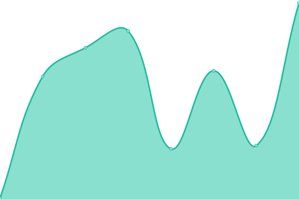
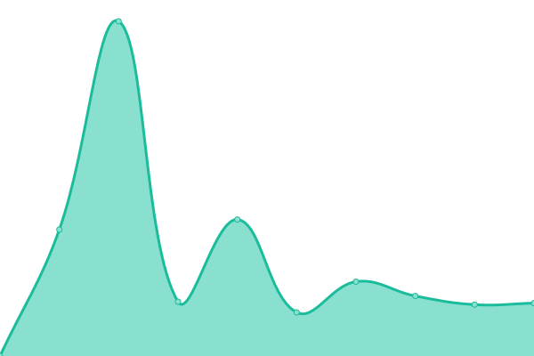

# [📈 Live Status](https://status.jb.works): <!--live status--> **🟩 All systems operational**

This repository contains the open-source uptime monitor and status page for [Jackbord](https://jackbord.org)

With [Upptime](https://upptime.js.org), you can get your own unlimited and free uptime monitor and status page, powered entirely by a GitHub repository. We use [Issues](https://github.com/jackbord/status/issues) as incident reports, [Actions](https://github.com/jackbord/status/actions) as uptime monitors, and [Pages](https://status.jb.works) for the status page.

<!--start: status pages-->
<!-- This summary is generated by Upptime (https://github.com/upptime/upptime) -->
<!-- Do not edit this manually, your changes will be overwritten -->
<!-- prettier-ignore -->
| URL | Status | History | Response Time | Uptime |
| --- | ------ | ------- | ------------- | ------ |
|  [Dashboard](https://jb.jackbord.org) | 🟩 Up | [dashboard.yml](https://github.com/jackbord/status/commits/HEAD/history/dashboard.yml) | 

 383ms
     
 | 

<a href="https://status.jb.works/history/dashboard">100.00%</a>
    

|  API | 🟩 Up | [api.yml](https://github.com/jackbord/status/commits/HEAD/history/api.yml) | 

 829ms
     
 | 

<a href="https://status.jb.works/history/api">100.00%</a>
    

|  [MQTT Primary](mqtta.jackbord.org) | 🟩 Up | [mqtt-primary.yml](https://github.com/jackbord/status/commits/HEAD/history/mqtt-primary.yml) | 

 177ms
     
 | 

<a href="https://status.jb.works/history/mqtt-primary">100.00%</a>
    

|  [MQTT Secondary](mqttb.jackbord.org) | 🟩 Up | [mqtt-secondary.yml](https://github.com/jackbord/status/commits/HEAD/history/mqtt-secondary.yml) | 

 178ms
     
 | 

<a href="https://status.jb.works/history/mqtt-secondary">100.00%</a>
    

|  [User site](https://jb.works) | 🟩 Up | [user-site.yml](https://github.com/jackbord/status/commits/HEAD/history/user-site.yml) | 

 977ms
     
 | 

<a href="https://status.jb.works/history/user-site">100.00%</a>
    

|  [Documentation](https://docs.jackbord.org) | 🟩 Up | [documentation.yml](https://github.com/jackbord/status/commits/HEAD/history/documentation.yml) | 

 332ms
     
 | 

<a href="https://status.jb.works/history/documentation">100.00%</a>
    

|  [Info site](https://jackbord.works) | 🟩 Up | [info-site.yml](https://github.com/jackbord/status/commits/HEAD/history/info-site.yml) | 

 888ms
     
 | 

<a href="https://status.jb.works/history/info-site">100.00%</a>
    

<!--end: status pages-->

[**Visit our status website →**](https://status.jb.works)

## 📄 License

- Powered by: [Upptime](https://github.com/upptime/upptime)
- Code: [MIT](./LICENSE) © [Anand Chowdhary](https://anandchowdhary.com), supported by [Pabio](https://pabio.com)
- Data in the `./history` directory: [Open Database License](https://opendatacommons.org/licenses/odbl/1-0/)
